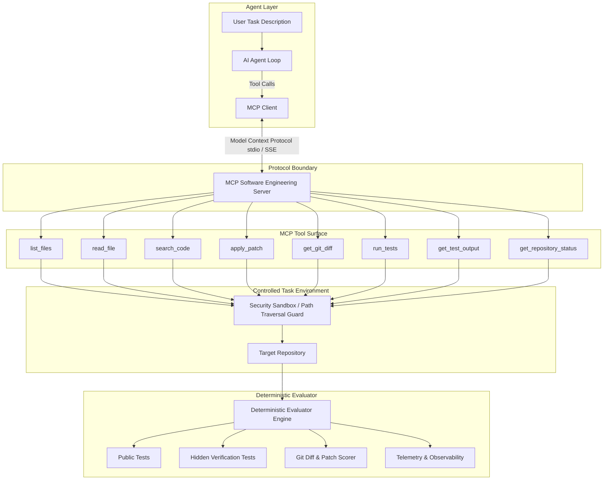

# MCP Software Engineering Agent & Deterministic Evaluation Environment

A serious, portfolio-grade framework demonstrating **Model Context Protocol (MCP)**, tool-calling autonomous software-engineering agents, sandboxed repository execution, and deterministic, multi-criteria verification.

---

## Architecture Overview



---

## Core Principles

1. **Deterministic Verification**: No subjective LLM grading ("looks good"). Solutions are scored against automated public tests, hidden test suites, patch validity, and regression safety.
2. **Strict Protocol Separation**: The agent communicates with the repository *strictly* through standardized MCP tools over the official MCP Python SDK v2.
3. **Least Privilege & Sandbox Security**: Strict path traversal prevention, command whitelisting, timeout enforcement, and workspace isolation.
4. **Reproducibility**: Every task instantiates from a fixed, known Git commit state inside a pristine workspace.
5. **Full Observability**: Comprehensive tracing of tool calls, inputs, outputs, execution latencies, test outcomes, and iteration counts.

---

## Repository Structure

```
├── README.md                      # Project documentation and architecture guide
├── LICENSE                        # MIT License
├── pyproject.toml                 # Project metadata, dependencies, and tools config
├── uv.lock                        # Deterministic dependency lockfile
├── .gitignore                     # Git ignore rules
├── .env.example                   # Environment variable template
│
├── src/
│   ├── mcp_server/                # Model Context Protocol server implementation
│   │   ├── server.py              # FastMCP / Core MCP server definition
│   │   ├── tools/                 # Tool implementations (filesystem, search, patch, test)
│   │   └── security/              # Path containment and sandbox security guards
│   │
│   ├── evaluator/                 # Deterministic verification and scoring engine
│   │   ├── runner.py              # Task test execution orchestrator
│   │   ├── verifier.py            # Hidden test and patch verifier
│   │   ├── scoring.py             # Weighted multi-factor scoring
│   │   └── metrics.py             # Telemetry and benchmark reporting
│   │
│   ├── tasks/                     # Benchmark task management
│   │   ├── schema.py              # Pydantic schemas for task definitions
│   │   ├── loader.py              # Task loader and validator
│   │   └── manager.py             # Workspace initialization and teardown
│   │
│   └── agent/                     # Autonomous agent implementation
│       ├── client.py              # MCP client session manager
│       ├── loop.py                # ReAct observe-reason-act-verify cycle
│       └── planner.py             # Strategy and sub-goal decomposition
│
├── tasks/                         # Benchmark task suites (bug fixes, features, refactoring)
├── tests/                         # Automated test suite
│   ├── unit/                      # Unit tests for tools, security, evaluator, schema
│   └── integration/               # End-to-end MCP client-server-task integration tests
├── scripts/                       # CLI helpers (evaluation runners, benchmarks)
├── docs/                          # Technical deep-dives and interview study guides
└── examples/                      # Recorded sessions and evaluation walkthroughs
```

---

## Development Phases

- [x] **Phase 0: Environment Setup & Project Foundation** *(Current)*
- [ ] **Phase 1: Core MCP Server & Filesystem Tools** (`list_files`, `read_file`, `search_code`)
- [ ] **Phase 2: Testing Tools & Output Capture** (`run_tests`, `get_test_output`)
- [ ] **Phase 3: Patching & Git Status Tools** (`apply_patch`, `get_git_diff`, `get_repository_status`)
- [ ] **Phase 4: Sandbox Security & Path Traversal Guards**
- [ ] **Phase 5: First Benchmark Task (`bug_fix_001`)**
- [ ] **Phase 6: Deterministic Evaluator & Scoring Engine**
- [ ] **Phase 7: MCP Client Layer**
- [ ] **Phase 8: Agent Execution Loop (Observe-Reason-Act-Verify)**
- [ ] **Phase 9: Comprehensive Benchmark Task Suite**
- [ ] **Phase 10: Dockerized Execution & Hermetic Environments**
- [ ] **Phase 11: End-to-End Benchmarking & Metrics Dashboard**
- [ ] **Phase 12: Documentation & Technical Defense Guide**
- [ ] **Phase 13: Live Interactive Demonstration**

---

## Getting Started

### Prerequisites
- Python 3.10+ (tested with Python 3.14)
- `uv` (fast Python package manager by Astral)
- Git

### Installation
```bash
# Clone the repository
git clone <repo-url>
cd CodeForgeX

# Install dependencies using uv
uv sync

# Run test suite
uv run pytest
```
